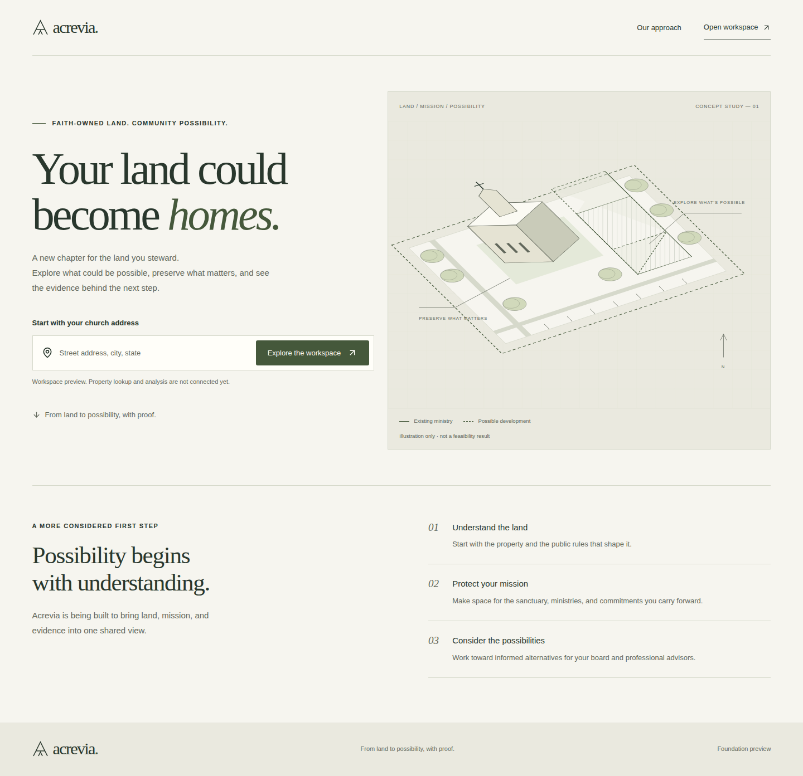
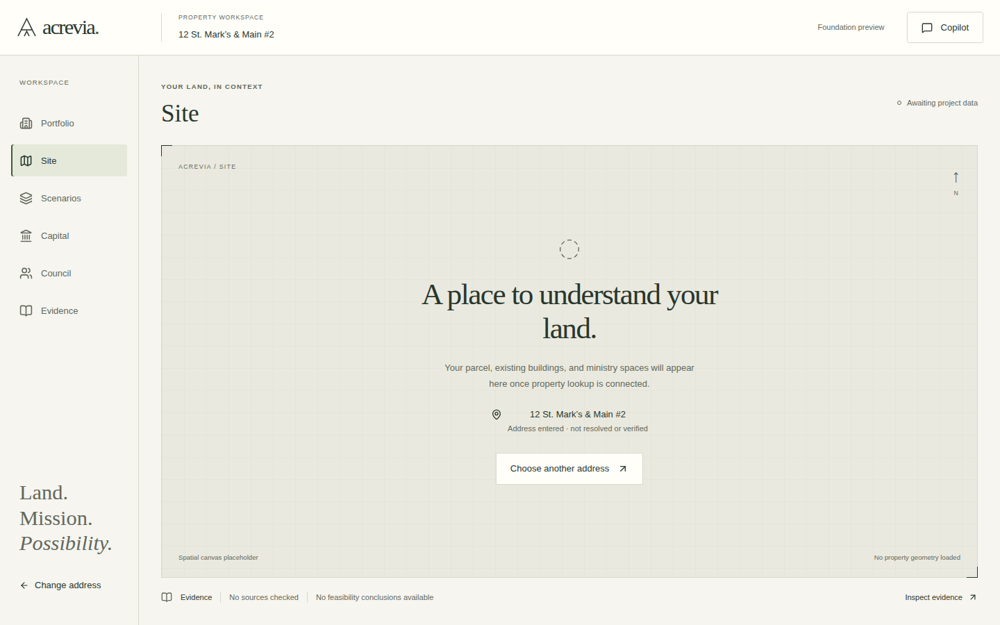
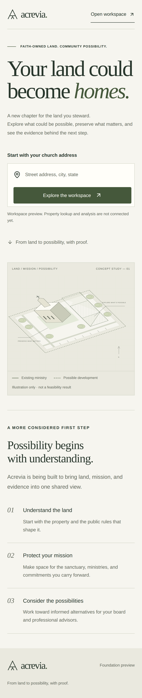
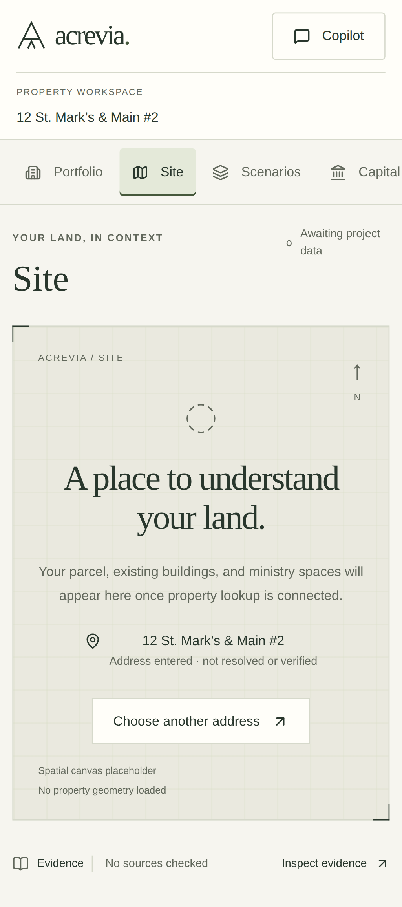

# Issue #1 review evidence

Reviewed 2026-10-02 against issue #1, Design Constitution, Development Playbook,
and Winning Standard. This is an implementation self-review; peer approval and
merge remain outstanding.

## Visible outcome

Enter an address, open the workspace, navigate all six surfaces, and open/close
the Copilot rail. The address remains visible through navigation and reload.
No property facts, numerical outcomes, or professional conclusions are fabricated.

## Checks run

- `npm run check`: lint and strict TypeScript pass; 7 component tests pass.
- `npm run build -- --webpack`: production compilation and prerendering pass.
  Default Turbopack build is blocked by worker-port restrictions on the local
  host, including when retried with permission. Default build needs verification
  on an unrestricted host. Automated CI is deferred: GitHub rejected the workflow
  push because the current OAuth sign-in lacks workflow scope.
- `npm run test:e2e`: 9 checks pass across 1440×900, 1280×800 and 390×844.
- Axe: no detected violations in landing, empty workspace, or open Copilot panel
  at each viewport. Automated checks do not replace assistive-technology review.
- No browser console errors in the address → workspace → navigation → Copilot flow.
- Keyboard: Copilot focus trapping, Escape dismissal, and focus restoration pass.
- Blank/excessive address input, unknown surface, missing route, and error recovery
  are covered. Stale state is component-tested; actual invalidation is deferred.
- Screenshots inspected: desktop/laptop landing and desktop/mobile workspace;
  mobile landing also inspected. No page-wide horizontal overflow. Mobile surface
  navigation intentionally scrolls horizontally to keep its labels accessible.
- `npm audit --omit=dev`: zero production vulnerabilities. The remaining lint-tool
  advisory and compatibility constraint are recorded in ADR 0001.

## Critique and disposition

- The first browser run matched Next.js's hidden route announcer as well as the
  intended error alert. Scoped assertions to the main region; rerun passed.
- Default Node type definitions targeted a newer runtime than the documented
  Node 22 baseline. Aligned them with Node 22.
- Removed unused issue metadata from the navigation model; kept domain contracts
  out of this foundation PR.
- Typography, alignment and restrained surfaces carry the hierarchy; there are
  no metric cards, fake testimonials, ambient animations, or unsupported results.
- The canvas occupies the main workspace. Copilot is closed by default and
  appears as an accessible right-side modal rail only when requested.
- Original landing artwork is explicitly conceptual. The empty workspace cannot
  be mistaken for a computed property view. Real spatial response, source
  inspection, mission controls, and scenario animation await their owning issues.

## Manual review

1. Run `npm ci`, then `npm run dev` (add `-- --webpack` on restricted hosts).
2. Open `/`. Submit an empty address; check the error. Enter any public address.
3. Open all six workspace surfaces. Refresh; the entered address remains.
4. Open Copilot. Tab stays in the panel; Escape closes it and restores focus.
5. Repeat at laptop and phone widths. Scroll mobile navigation to Evidence.
6. Visit `/workspace` for the empty entry and `/missing-page` for recovery.

## Screenshots

Test address shown below is arbitrary input, explicitly unresolved and unverified.

### Desktop landing

### Desktop workspace

### Mobile landing

### Mobile workspace

